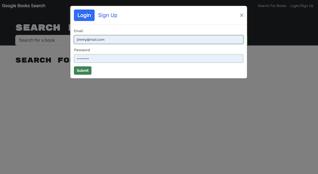
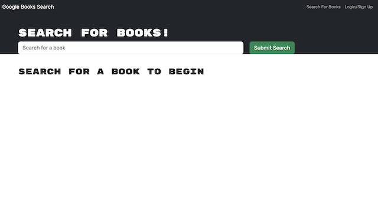
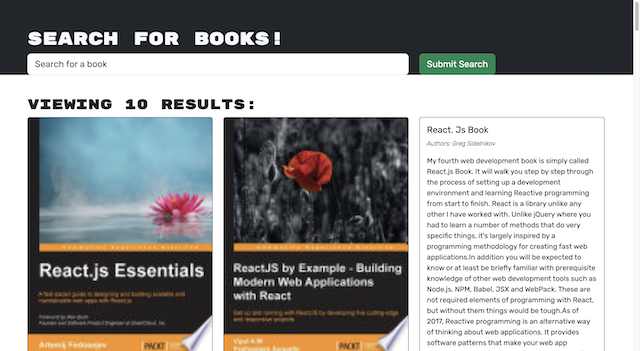
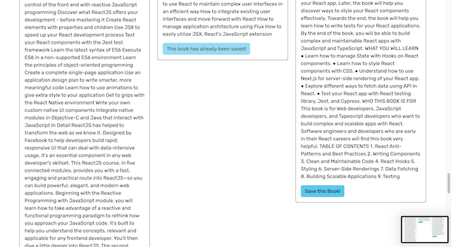
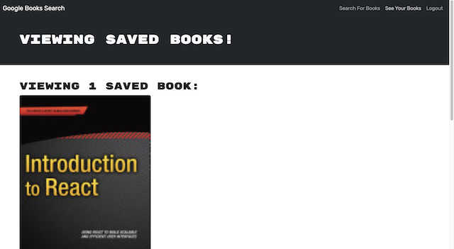

# Book-Search-Engine

  

  ## Deployed Site [Link](https://peaceful-stream-10972.herokuapp.com/)

  ## Description:
        
  A full stack application that allows you to create a profile  that you can then search and save books to. 
    
  ---
  
  ## Table of Contents:
    
  - [Instillation](#instillation)
  - [Usage](#usage)
  - [ScreenShots](@screenshots)
  - [Credits](#credits)
  - [License](#license)
  - [Questions](#questions)
  
  ## Instillation:
  
  You can view the live site [here](https://peaceful-stream-10972.herokuapp.com/), You can also clone the [github repository](https://github.com/Jamesgit22/Book-Search-Engine) to your local machine. You will need to create and connect mongoDB if you choose to run locally.
  
  ## Usage:
  
  Have one central location to easily keep track of books that you want to read or that you have read while exploring the codebase behind a full stack application using React, MongoDB, and Apollo.
  
  ## ScreenShots:

  ---

  

  

  

  

  

  ---

  ## Credits:

  Third-party Assets:
  - React
  - Node.js
  - Express
  - MongoDB
  - Mongoose
  - Apollo
  - Bcrypt
  - GraphQL
  - Bootstrap
  - Jest
  - Atlas
  - Heroku
  
  
  ## License:
  
  This project uses the [MIT](https://opensource.org/licenses/MIT) license.

  ## Tests:

      "scripts": {
        "test": "react-scripts test",
      },

  ---
  
  ## Questions:

  Please feel free to get in contact if you have any questions about this project.

  - Github: [Jamesgit22](https://github.com/Jamesgit22)
  - Email: jschroeder2296@gmail.com